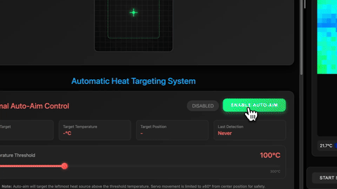

# 🔥 Fire-Fighting Robot

<div align="center">
  
  [](https://opensource.org/licenses/MIT)
  [](https://docs.ros.org/en/humble/)
  [](https://www.python.org/)
  [](https://ubuntu.com/)
  
  <h3>Autonomous Fire Detection and Suppression Robot</h3>
  
  
  
</div>

---

## 🎯 Project Overview

An autonomous robotic system designed to detect and respond to fire emergencies. The robot operates primarily through automated pathfinding and fire detection algorithms, with thermal imaging and LIDAR navigation providing real-time environmental awareness for intelligent fire suppression response.

### ✨ Key Features

- 🔥 **Automated Fire Detection** - MLX90640 thermal camera automatically identifies heat sources
- 🗺️ **Autonomous Pathfinding** - YDLIDAR G2 enables SLAM-based navigation to fire locations
- 🤖 **Intelligent Response System** - Automated decision-making for optimal fire suppression approach
- 🌐 **Testing Dashboard** - Web interface for troubleshooting and system logic verification
- 📡 **Wireless Operation** - WiFi connectivity for remote monitoring during testing

---

## 🎬 Demo Videos

<div align="center">

### Dashboard Control & Fire Suppression
<table>
<tr>
<td width="50%">
  
  
  
  *Dashboard-controlled aiming system*
</td>
<td width="50%">
  
  
  
  *Hot water fire suppression test*
</td>
</tr>
</table>

### System Calibration & Navigation
<table>
<tr>
<td width="50%">
  
  
  
  *Robot body calibration process*
</td>
<td width="50%">
  
  
  
  *Autonomous obstacle avoidance*
</td>
</tr>
</table>

### Fire Detection Views
<table>
<tr>
<td width="50%">
  
  
  
  *Top-down fire detection view*
</td>
<td width="50%">
  
  
  
  *Front-facing fire detection*
</td>
</tr>
</table>

</div>

---

## 🚀 Quick Start

### 1. SSH Connection
```bash
ssh ubuntu-robot-pi4@ubuntu-robot.local
# Password: 000000
```

### 2. Launch Robot System
```bash
ros2 launch fire_fighting_robot_bringup robot_bringup.launch.py
```

### 3. Access Dashboard
Open browser and navigate to: `http://robot-ip:5001`

---

## 📋 Documentation

<div align="center">

### 📖 **[Common Use Codes & Commands](docs/COMMON_CODES.md)**

Complete reference for all frequently used commands, including:
- SSH & Network Setup
- ROS2 Launch Commands  
- System Control
- Troubleshooting
- Dashboard Operations

</div>

---

## 🔧 Hardware Components

| Component | Model | Purpose |
|-----------|-------|---------|
| **Controller** | Raspberry Pi 4 (4GB) | Main processing unit |
| **LIDAR** | YDLIDAR G2 | 360° environmental scanning |
| **Thermal Camera** | MLX90640 | Fire detection (32x24 IR array) |
| **Motor Driver** | PCA9685 | 16-channel PWM control |
| **Motors** | 4x DC Motors | Differential drive system |

---

## 💻 Software Stack

- **OS**: Ubuntu 22.04 Server
- **Framework**: ROS2 Humble
- **Languages**: Python 3.8+, C++
- **Dashboard**: Flask + WebSocket

---

---